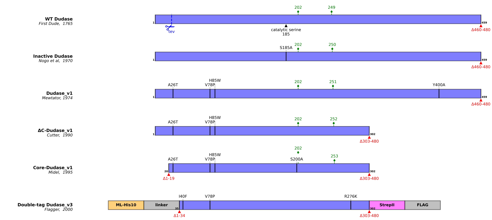

# VariantPlot

VariantPlot can be used to easily create figures that highlight the features of protein constructs & variant. Single proteins can be plotted, but you can also use VariantPlot to generate figures that compare different protein constructs (e.g. truncations, mutants, tagged variants).  

Here's an example of what the output looks like by default, but there's lots of options for customisation too. 

All you need is to fill in some basic information in a template Excel sheet. 

Currently, you can easily annotate things such as:
- sequence start and end residues
- substitution sites
- glycosylation sites
- residue, site-specific user-defined labels
- protease cut-sites
- N-terminal tags/flanks
- C-terminal tags/flanks
- Variant name & references

VariantPlot can output both png files or svg files, the latter of which can be easily edited further in programs such as Illustrator. 

The style of the figures is customisable without having to edit code - you can easily change colors, fonts, text size etc. 

Please let me know if you have any requests for additional features or run into any bugs or issues. 
